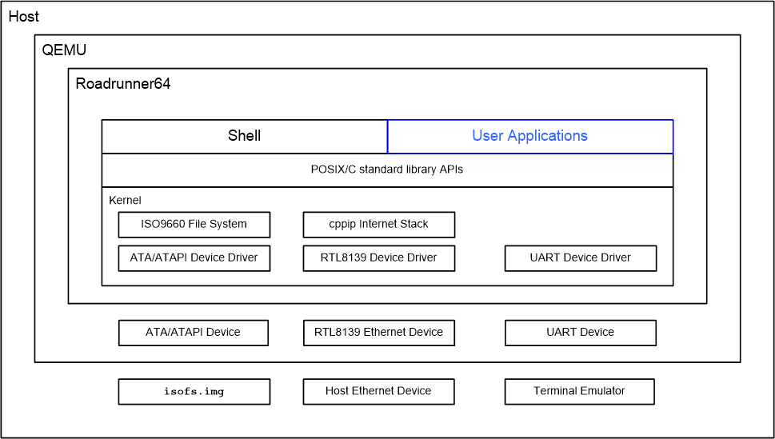

# Roadrunner64


Roadrunner64 single-user, single-threaded operating system for Intel x86_64
machines that support 64-bit addressing and data types.  The kernel boots
the processor into 64-bit long mode with a flat memory model and no virtual
addressing or memory protection.

Users interact with the operating system through the Roadrunner shell
command line interface.

The kernel includes an ATA driver to access the QEMU virtual machine image
as the primary hard drive.  The driver is used to enumerate the ATA
connected devices at boot time.  The first partition on the first device
that must be a hard drive on the first ATA controller is used at the
primary volume.

Support for access to the ISO9660 file system resident in the QEMU virtual
is available.  This file system is represented with a traditional path
model in the shell.  It is also available through a standard POSIX
open/close/read/write interface.

<p align="center"></p>

To run Roadrunner64 you will need to have xorriso and QEMU installed on
your Linux distro.  For Ubuntu you can do this:

```
$ sudo apt-get install xorriso qemu-system
```

One you have these installed you can type:

```
$ make run
...
Roadrunner 64-bit
Type ctrl-a x to exit
/>
```

The 64-bit long mode boot code is based on
https://github.com/winksaville/baremetal-x86_64
